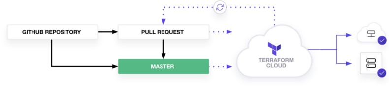
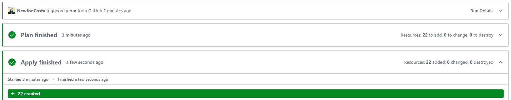

# Using Modules from Terraform public registry and Terraform Cloud

Quick example on how using AWS Terraform Module from Terraform public registry to provision an AWS environment.

### Resource provisioned:
- VPC
- Private/Public subnets
- Security groups
- NAT gateways 
- (2) EC2 instances.

### Module used
- [VPC Module](https://registry.terraform.io/modules/terraform-aws-modules/vpc/aws/3.14.0)
- [EC2-Instance Module](https://registry.terraform.io/modules/terraform-aws-modules/ec2-instance/aws/latest)

### How to use
For this demo I used Terraform Cloud workflow.[Know more about Terraform Cloud here](https://developer.hashicorp.com/terraform/tutorials/cloud-get-started)

In order to compleete this demo, you will need the following:

 Terraform v1.1+ [installed locally](https://developer.hashicorp.com/terraform/tutorials/aws-get-started/install-cli)
- An [AWS account](https://portal.aws.amazon.com/billing/signup?nc2=h_ct&src=default&redirect_url=https%3A%2F%2Faws.amazon.com%2Fregistration-confirmation#/start)
- [Terraform Cloud account](https://app.terraform.io/public/signup/account?utm_source=learn)
- [Terraform Cloud variable set configured with your AWS credentials.](https://developer.hashicorp.com/terraform/tutorials/cloud-get-started/cloud-create-variable-set)

### Things that I learn from this demo 💪💪
- Understand how Terraform registry modules work
- Structuring the terraform code by referecing reusbale module
- Integrating Terraform cloud with GitHub